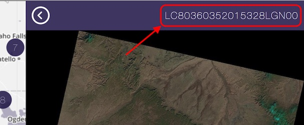

# Create a pansharpened natural color image from Landsat 8

Landsat 8 imagery is a great source of free imagery for the world, with new images every two weeks. The best tool for exploring landsat 8 imagery is [Libra](http://libra.developmentseed.org) by [Development Seed](https://developmentseed.org).

1. Use [Libra](http://libra.developmentseed.org) to browse for the best Landsat 8 images for your area of interest
2. Select the scene you are interested in and copy the unique sceneID (see below)

    

3. Use the `landsat` tool to download the scene: (the empty `--bands` argument is needed until [#132](https://github.com/developmentseed/landsat-util/pull/132) is resolved)

    ```sh
    landsat download LC80360352015328LGN00 --bands ""
    ```

4. Process the image combining bands 432 (natural colors), balancing color, and sharpening to 15m resolution with band 8 (the panchromatic band):

    ```sh
    landsat process ~/landsat/downloads/LC80360352015328LGN00.tar.bz --pansharpen
    ```

5. Clip the resulting image to interest area. The coordinates must be in same coordinate system as the image - in this case EPSG:3857 ("Google Mercator").

    ```sh
    cd ~/landsat/processed/LC80360352015328LGN00/
    gdal_translate -projwin -6598000 256250 -6576480 240000 LC80360352015328LGN00_bands_432_pan.TIF LC80360352015328LGN00_bands_432_pan_clip.TIF
    ```

6. "Overscale" the image by increasing the resolution, for zoomed in map tiles. I doubled the pixel width and height (from gdalinfo) here:

    ```sh
    gdalwarp -ts 5772 4710 -r cubicspline LC80360352015328LGN00_bands_432_pan_clip.TIF LC80360352015328LGN00_bands_432_pan_clip_2x.TIF
    ```

7. Create image tiles and upload them to S3

    ```sh
    mapbox-tile-copy LC80360352015328LGN00_bands_432_pan_clip.TIF s3://my-bucket/LC80360352015328LGN00_tiles/{z}/{x}/{y}.webp
    ```

    The tiles are saved as `webp` format - this is [hard-coded in tilelive-omnivore](https://github.com/mapbox/tilelive-omnivore/issues/1) it seems. `webp` only works in [Chrome and Opera](http://caniuse.com/#feat=webp). **[EDIT]:** You can save tiles as jpg using [this fork](https://github.com/digidem/mapbox-tile-copy) `npm install -g digidem/mapbox-tile-copy`

8. Copy pansharpened geotiff to s3:

    ```sh
    aws s3 cp ~/landsat/processed/LC80360352015328LGN00/LC80360352015328LGN00_bands_432_pan_clip.TIF s3://my-bucket/geotiffs/
    ```
